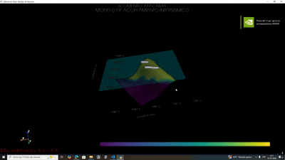
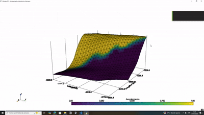
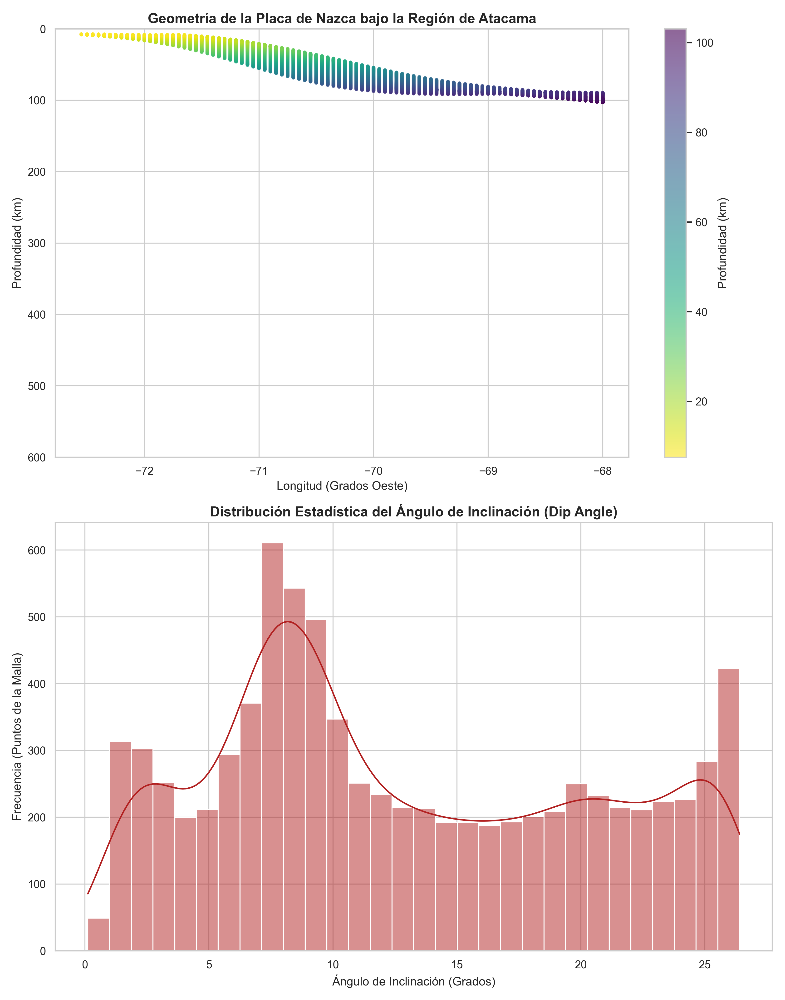
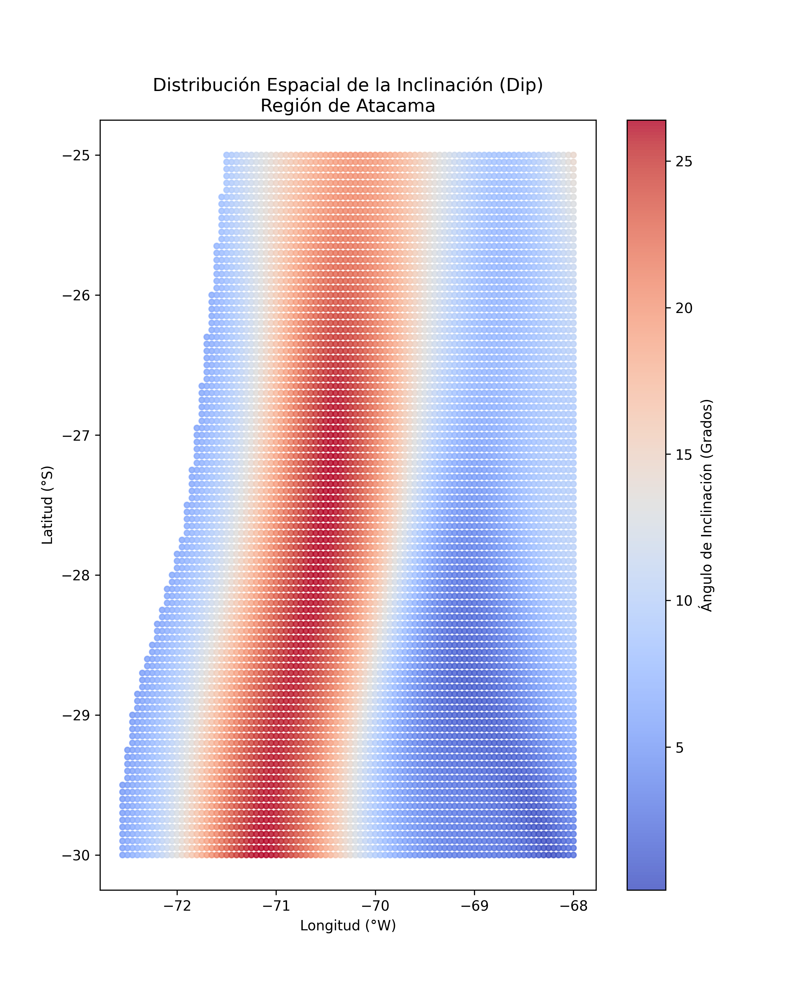
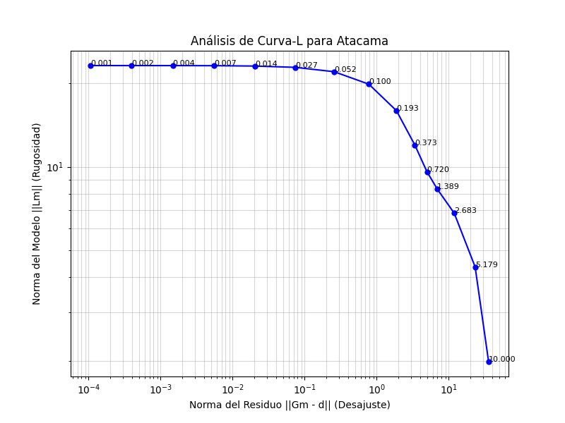
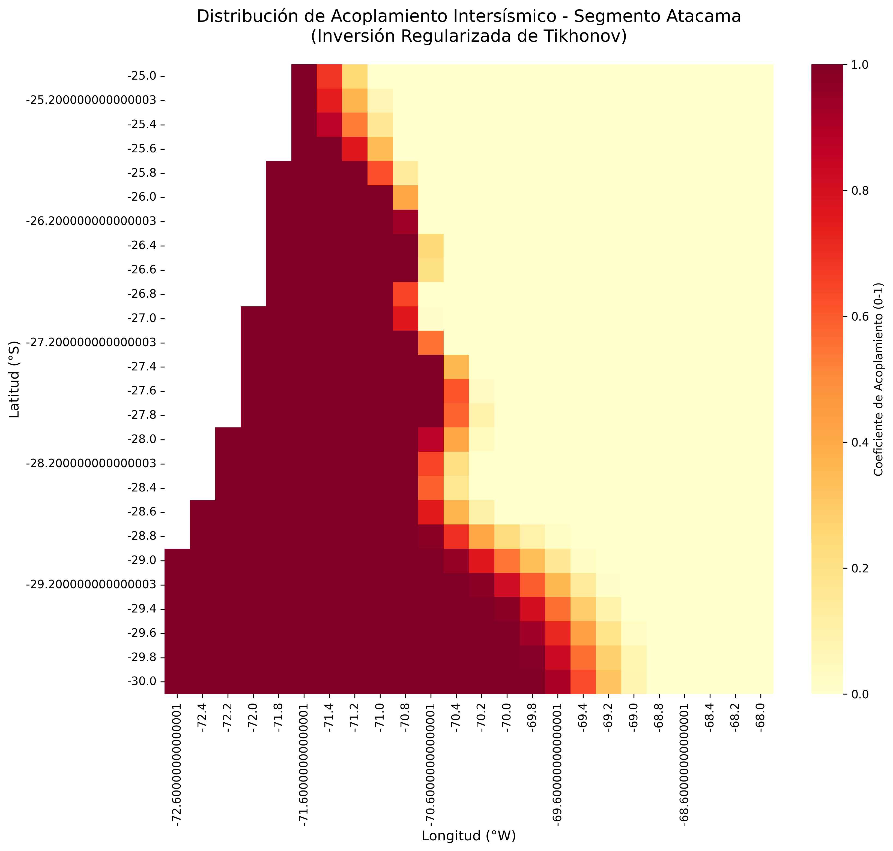
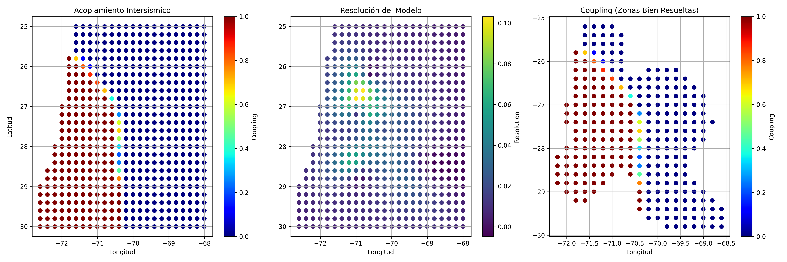
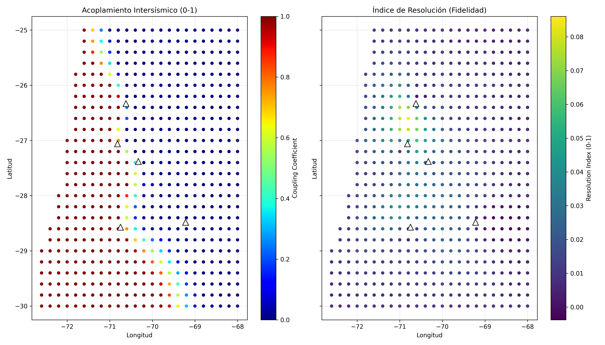
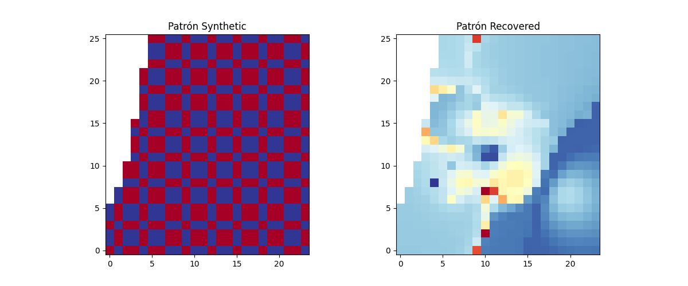

# 🌋 Interseismic Coupling - Atacama Segment (-25° to -30°)
**Autor:** Martín Aravena  
Este repositorio presenta una plataforma reproducible de modelamiento geofísico en Python, integrando geodesia espacial, inversión matemática y computación científica para el análisis de deformación cortical y procesos tectónicos.
--
[](https://www.python.org/downloads/)
[]()
[](https://opensource.org/licenses/MIT)

## 🎥 Visualización del Modelo 3D
<p align="center">
  
  
</p>
--
## 📌 Resumen Ejecutivo

Este repositorio alberga el marco computacional desarrollado para una tesis de pregrado en **Geografía y Geociencias**, enfocado en el modelamiento del acoplamiento intersísmico en el norte de Chile.

El proyecto implementa un **Modelamiento Inverso Cinemático** para estimar la distribución espacial del acoplamiento sísmico (coupling), utilizando:

- datos GNSS del **Centro Sismológico Nacional (CSN)**
- geometría de subducción basada en **Slab2.0 (USGS)**
- formulación elástica de **Okada (1985)**

El objetivo es cuantificar el **potencial sísmico acumulado desde el terremoto de 1922** en el segmento de Atacama.

---
## 📊 Resultados y Análisis Geofísico

### 1. Caracterización de la Geometría de Subducción
El modelo se sustenta en una representación precisa de la placa de Nazca bajo la región de Atacama utilizando datos de **Slab2.0**.

<p align="center">
  
  
</p>

*   **Geometría de la Placa**: Perfil de profundidad esencial para definir el área de contacto sismogénico y aplicar un perfil de rigidez variable ($\mu$).
*   **Distribución del Dip**: Mapeo del ángulo de inclinación, fundamental para el cálculo de las Funciones de Green según la formulación de Okada (1985).

### 2. Optimización por Curva-L (Tikhonov)
Para resolver la inversión de forma estable, se determinó el equilibrio óptimo entre el ajuste de datos y la suavidad del modelo mediante regularización.

<p align="center">
  
</p>

*   **Parámetro $\lambda$**: El análisis identifica a $\lambda = 0.1$ como el punto de máxima curvatura, permitiendo una solución físicamente consistente y estable.

### 3. Distribución del Acoplamiento (Coupling) y Mapas Finales
Este es el núcleo de la investigación, donde se identifican las asperezas o zonas de bloqueo total en la interfaz.

<p align="center">
  
</p>

*   **Distribución de Asperezas**: Los valores cercanos a 1.0 (rojo oscuro) indican un bloqueo total de la falla.
*   **Potencial Sísmico**: El alto acoplamiento identificado sustenta el cálculo de una **magnitud potencial $M_w$ entre 8.74 y 8.96**.

<p align="center">
  
</p>

*   **Ajuste de Vectores**: Esta visualización combina la distribución de asperezas con el ajuste de los vectores GNSS observados en el terreno.

### 4. Validez de Fidelidad y Resolución
Se incluyen pruebas de robustez para asegurar que los parches de acoplamiento sean estadísticamente significativos.

<p align="center">
  
  
</p>

*   **Resolución del Modelo**: Identificación de las zonas donde la densidad de la red GNSS permite una recuperación confiable de la señal sísmica.
*   **Checkerboard Test**: Validación de sensibilidad que demuestra la capacidad del sistema para detectar parches de acoplamiento discretos.

## 🚀 Componentes Innovadores y Habilidades Destacadas

### 🧠 1. Rigurosidad Geofísica y Matemática

- **Regularización de Tikhonov (L2)**  
  Selección óptima del parámetro de suavizado mediante Curva-L  
  → λ ≈ **0.1 – 0.19**

- **Perfil de Rigidez Variable (μ)**  
  Implementación de un modelo reológico dependiente de profundidad:

  - 0–15 km → 25–30 GPa  
  - 15–40 km → 40 GPa  
  - >40 km → hasta 45–60 GPa  

  Esto mejora significativamente la estimación del momento sísmico.

- **Modelamiento de Okada (1985)**  
  Uso de Funciones de Green para proyectar slip en la falla hacia desplazamientos GNSS observables.

---

### ⚙️ 2. Ingeniería de Software Aplicada a la Ciencia

- Arquitectura modular (física, inversión, análisis, visualización)
- Pipeline automatizado (`run_all_atacama.py`)
- Código reproducible y escalable
- Integración de librerías científicas (NumPy, SciPy, Pandas, PyVista)

---

### 🔬 3. Validación y Robustez del Modelo

El modelo incorpora múltiples controles de calidad:

- ✔️ Curva-L (optimización de λ)  
- ✔️ Checkerboard test (capacidad de resolución espacial)  
- ✔️ Matriz de resolución (diagnóstico de confiabilidad)  
- ✔️ Escenarios múltiples:
  - modelo total  
  - zona sismogénica  
  - modelo robusto (filtrado y ponderado)

---

## 📊 Hallazgos Críticos (Periodo 1922–2026)

Tras un silencio sísmico de **104 años**, el modelo identifica un potencial significativo en el segmento de Atacama:

| Parámetro | Valor Estimado | Implicancia |
|----------|---------------|------------|
| Acoplamiento Promedio | 0.339 | Zona con parches de alta fricción |
| Slip Máximo | 6.76 m | Acumulación tectónica significativa |
| Momento Sísmico ($M_0$) | ~10²² N·m | Energía acumulada |
| Magnitud Potencial ($M_w$) | **8.74 – 8.79** | Límite físico superior |
| Escenario Conservador | **8.3 – 8.6** | Considerando resolución |

---

## ⚠️ Interpretación Física

- 🟡 **Alto acoplamiento (~1.0)**  
  → zonas bloqueadas (asperidades)

- 🟣 **Bajo acoplamiento**  
  → creep o liberación estable

El modelo identifica una **asperidad somera dominante**, consistente con:

- régimen friccional de la interfaz  
- subducción de bajo ángulo (~8°)  
- mayor sensibilidad de GNSS en superficie  

---

## ⚠️ Consideraciones Críticas

> Valores cercanos a 1.0 pueden representar:
> - bloqueo real  
> - o saturación del modelo inverso (limitacion matematica)

Además:

- la resolución disminuye con la profundidad  
- el acoplamiento profundo puede estar subestimado  
- los resultados dependen del parámetro de regularización  

---

## 📐 Base Física del Modelo

El momento sísmico se calcula como:

\[
M_0 = \mu \cdot A \cdot D
\]

y la magnitud:

\[
M_w = \frac{2}{3} \log_{10}(M_0) - 6.07
\]

---

## 🌍 Visualización 3D Interactiva

El proyecto incluye visualización avanzada en 3D mediante **PyVista**:

- interfaz de subducción en 3D  
- mapa de acoplamiento proyectado  
- plano superficial (nivel del mar)  
- ciudades representadas como volúmenes (Copiapó, Caldera, Vallenar)  

Esto permite visualizar directamente:

> la relación entre zonas urbanas y la interfaz activa de subducción


---
## 📂 Arquitectura del Proyecto

```text
PROYECTO_TITULO_ATACAMA/
├── 01_Data/                     # Datos de entrada brutos
│   ├── GNSS/                    # Series temporales y vectores de velocidad
│   └── Slab2/                   # Geometría de subducción (depth, dip, strike)
├── 02_Scripts/                  # Núcleo del procesamiento sismológico
│   ├── 01_Preprocessing.py      # Limpieza y filtrado GNSS
│   ├── 02_Geometry_Mesh.py      # Generación de malla de sub-fallas
│   ├── 04_Greens_Matrix.py      # Funciones de Green (Okada 1985)
│   ├── 05a_Analisis_CurvaL.py   # Optimización de λ (Curva-L)
│   ├── 05b_Inversion_Final.py   # Inversión (Tikhonov)
│   ├── 05c_Analisis_Resolucion.py # Matriz de resolución
│   ├── 08_Analisis_Final_Atacama.py # Cálculo de Mw y M0
│   ├── 08_Checkerboard_Test.py  # Test de resolución espacial
│   ├── 09_Visualizacion_3D.py   # Visualización PyVista
│   ├── physics_engine.py        # Perfil de rigidez μ(z)
│   └── run_all_atacama.py       # Pipeline completo
├── 03_Output/                   # Resultados del modelo
│   ├── Data/                    # GNSS procesado
│   ├── Models/                  # Matrices (.npy) y resultados (.csv)
│   └── Plots/                   # Curva-L, mapas, perfiles
├── 04_Draft/                    # Experimentos y versiones preliminares
└── README.md                    # Documentación técnica

## 🚀 Quick Start (Inicio Rápido)

Para replicar este estudio en su entorno local, siga estos pasos:

```bash
# 1. Clonar el repositorio
git clone https://github.com/tu_usuario/Proyecto_Titulo_Atacama.git
cd Proyecto_Titulo_Atacama

# 2. Instalar dependencias
pip install -r requirements.txt

# 3. Ejecutar el pipeline completo
python 02_Scripts/run_all_atacama.py
